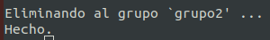

## Parte 1: Gestión de Usuarios
1. Creación de Usuarios: Crea tres usuarios llamados `usuario1`, `usuario2` y `usuario3`.
Comandos utilizados:

	sudo adduser usuario1
	sudo adduser usuario2
	sudo adduser usuario3

Salida de consola:

Usuario1:

Usuario2:

Usuario 3:

2. Asignación de Contraseñas: Establece una nueva contraseñas para cada usuario creado.

Comandos utilizados:

	sudo passwd usuario1
	sudo passwd usuario2
	sudo passwd usuario3

Salida de consola:

3. Información de Usuarios: Muestra la información de `usuario1` usando el comando `id`.

Comando utilizado:

	id usuario1

Salida de consola:

4. Eliminación de Usuarios: Elimina `usuario3`, pero conserva su directorio principal.

Comando utilizado:

	sudo deluser usuario3

Salida de consola:

## Parte 2: Gestión de Grupos
1. Creación de Grupos: Crea dos grupos llamados `grupo1` y `grupo2`.
Comandos utilizados:

	sudo addgroup grupo1
	sudo addgroup grupo2

Salida de consola:

2. Agregar Usuarios a Grupos: Agrega `usuario1` a `grupo1` y `usuario2` a `grupo2`.

Comandos utilizados:

	sudo adduser usuario1 grupo1
	sudo adduser usuario2 grupo2

Salida de consola:

3. Verificar Membresía: Verifica que los usuarios han sido agregados a los grupos utilizando el comando `groups`.
Comandos utilizados:

	groups usuario1
	groups usuario2

Salida de consola:

4. Eliminar Grupo: Elimina `grupo2`.

Comandos utilizados:

	sudo delgroup grupo2

Salida de consola:

## Parte 3: Gestión de Permisos
1. Creación de Archivos y Directorios:
Como `usuario1`, crea un archivo llamado `archivo1.txt` en su directorio principal y escribe algo en él.
Crea un directorio llamado `directorio1` y dentro de ese directorio, un archivo llamado `archivo2.txt`.

