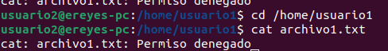

201612326

## Parte 1: Gestión de Usuarios
1. Creación de Usuarios: Crea tres usuarios llamados `usuario1`, `usuario2` y `usuario3`.

Comandos utilizados:

	sudo adduser usuario1
	sudo adduser usuario2
	sudo adduser usuario3

Salida de consola:

Usuario1:

Usuario2:

Usuario 3:

2. Asignación de Contraseñas: Establece una nueva contraseñas para cada usuario creado.

Comandos utilizados:

	sudo passwd usuario1
	sudo passwd usuario2
	sudo passwd usuario3

Salida de consola:

3. Información de Usuarios: Muestra la información de `usuario1` usando el comando `id`.

Comando utilizado:

	id usuario1

Salida de consola:

4. Eliminación de Usuarios: Elimina `usuario3`, pero conserva su directorio principal.

Comando utilizado:

	sudo deluser usuario3

Salida de consola:

## Parte 2: Gestión de Grupos
1. Creación de Grupos: Crea dos grupos llamados `grupo1` y `grupo2`.

Comandos utilizados:

	sudo addgroup grupo1
	sudo addgroup grupo2

Salida de consola:

2. Agregar Usuarios a Grupos: Agrega `usuario1` a `grupo1` y `usuario2` a `grupo2`.

Comandos utilizados:

	sudo adduser usuario1 grupo1
	sudo adduser usuario2 grupo2

Salida de consola:

3. Verificar Membresía: Verifica que los usuarios han sido agregados a los grupos utilizando el comando `groups`.

Comandos utilizados:

	groups usuario1
	groups usuario2

Salida de consola:

4. Eliminar Grupo: Elimina `grupo2`.

Comandos utilizados:

	sudo delgroup grupo2

Salida de consola:

## Parte 3: Gestión de Permisos
1. Creación de Archivos y Directorios:
1.1. Como `usuario1`, crea un archivo llamado `archivo1.txt` en su directorio principal y escribe algo en él.
1.2. Crea un directorio llamado `directorio1` y dentro de ese directorio, un archivo llamado `archivo2.txt`.

Comandos utilizados:

	echo "Archivo del usuario1" > archivo1.txt
	mkdir directorio1
	cd directorio1
	echo "Archivo del usuario 1 en un directorio" > archivo2.txt
	
Salida de consola:

2. Verificar Permisos: Verifica los permisos del archivo y directorio usando el comando `ls -l` y `ls -ld` respectivamente.

Comandos utilizados:

	ls -l
	ls -ld
	
Salida de consola:

3. Modificar Permisos usando `chmod` con Modo Numérico: Cambia los permisos del `archivo1.txt` para que sólo `usuario1` pueda leer y escribir (permisos `rw-`), el grupo pueda leer (permisos `r--`) y nadie más pueda hacer nada.

Comando utilizado:

	chmod 640 archivo1.txt
	
Salida de consola:

4. Modificar Permisos usando `chmod` con Modo Simbólico: Agrega permiso de ejecución al propietario del `archivo2.txt`.

Comandos utilizados:

	chmod u+x archivo2.txt
	
Salida de consola:

5. Cambiar el Grupo Propietario: Cambia el grupo propietario de `archivo2.txt` a `grupo1`.

Comando utilizado:

	chown :grupo1 archivo2.txt
	
Salida de consola:

6. Configurar Permisos de Directorio: Cambia los permisos del `directorio1` para que sólo el propietario pueda entrar (permisos `rwx`), el grupo pueda listar contenidos pero no entrar (permisos `r--`), y otros no puedan hacer nada.

Comando utilizado:

	chmod 750 directorio1
	
Salida de consola:

7. Comprobación de Acceso: Intenta acceder al `archivo1.txt` y `directorio1/archivo2.txt` como `usuario2`. Nota cómo el permiso de directorio afecta el acceso a los archivos dentro de él.

Comandos utilizados:

	cd /home/usuario1
	cat archivo1.txt
	
Salida de consola:

8. Verificación Final: Verifica los permisos y propietario de los archivos y directorio nuevamente con `ls -l` y `ls -ld`.

Comandos utilizados:

	ls -l
	ls -ld

Salida de consola:

## Reflexión: (Opcional)

Contestar las siguientes preguntas:

### ¿Por qué es importante gestionar correctamente los usuarios y permisos en un sistema operativo?

La gestión adecuada de usuarios y permisos en un sistema operativo es crucial para garantizar la seguridad, el control de acceso, la prevención de errores y el cumplimiento de políticas.

### ¿Qué otros comandos o técnicas conocen para gestionar permisos en Linux?

Además de los mencionados, otros comandos incluyen chown, umask, setfacl, técnicas como usar archivos de configuración y restricción de comandos como su y sudo.
